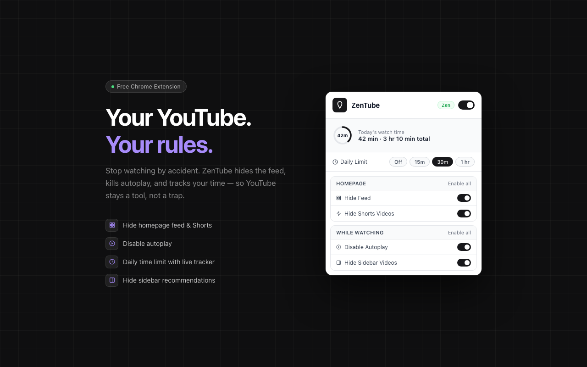
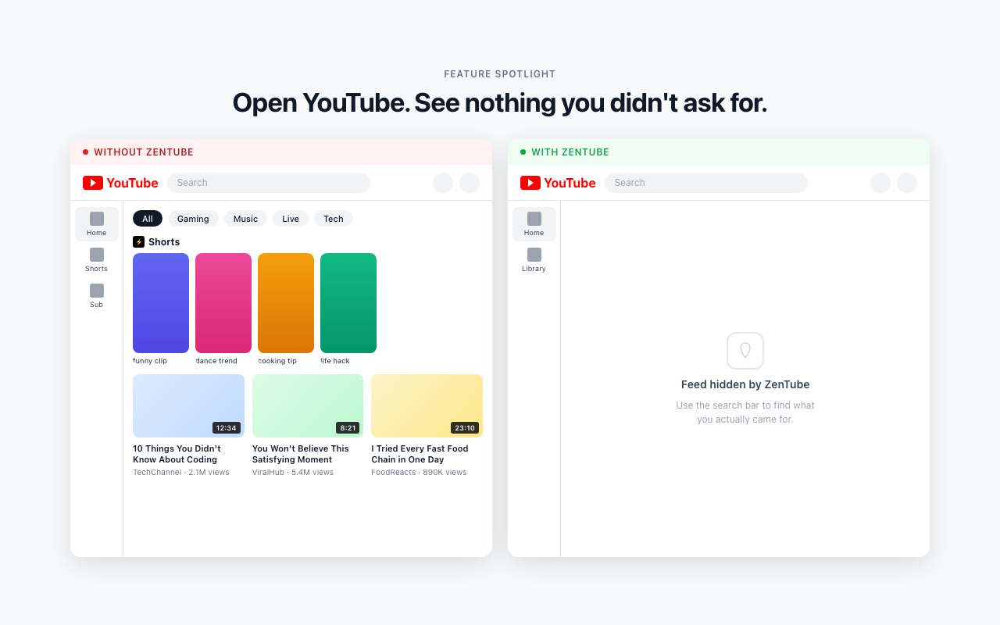
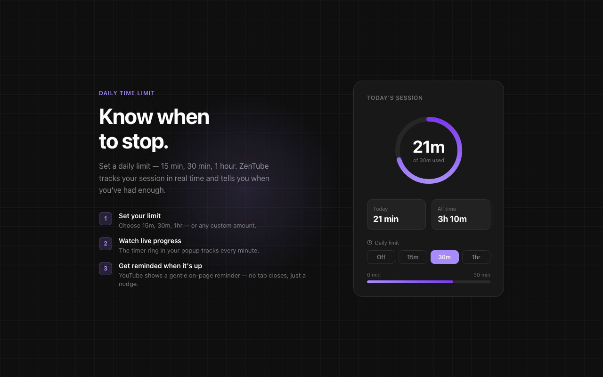
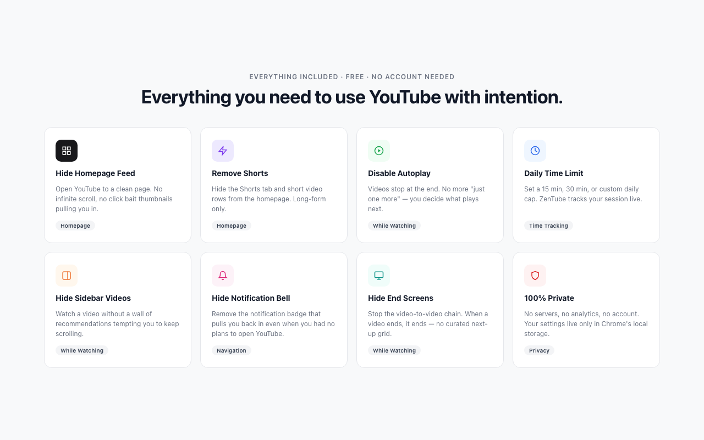

# ZenTube

I kept opening YouTube for one video and losing the entire evening. Not once — every single time.

So I built this.

**ZenTube is a Chrome extension that removes every hook YouTube uses to keep you watching.** Hide the feed, kill autoplay, set a daily limit. Open YouTube with intention, not because the algorithm invited you.

[**→ Add to Chrome**](https://chromewebstore.google.com/detail/zentube/ljnjkcelmlkcdcghffobikpjlefjaldh) &nbsp;·&nbsp; [Website](https://raghav4.github.io/ZenTube/)
<!-- &nbsp;·&nbsp; [Buy me a coffee ☕](https://www.buymeacoffee.com/raghavsharma) -->



---

## What it does

| Feature | What it does |
|---|---|
| **Hide Feed** | Blank out the homepage so you open YouTube with purpose |
| **Disable Autoplay** | Every video ends intentionally |
| **Daily Time Limit** | Countdown timer in the corner; full-screen overlay pauses the video when time's up |
| **Hide Sidebar Videos** | Remove the "Up Next" rabbit hole |
| **Hide Shorts** | Block Shorts from the feed and remove the tab |
| **Hide Comments** | Watch without the noise below |
| **Hide Notification Bell** | Kill the urgency loop |
| **Hide End Screens** | No more clickbait cards in the last 20 seconds |
| **Hide Merch** | Remove the shelf below videos |
| **Hide Live Chat** | Cleaner viewing on livestreams |
| **Hide Subscriptions Tab** | Remove the entire subscriptions section from the sidebar |
| **Disable Playlists** | Strip playlist params from URLs so videos play standalone |

### Presets

- **Light** — Disable autoplay + hide sidebar videos
- **Balanced** — Recommended; adds end screens, Shorts tab, notification bell, merch
- **Zen** — Everything off: feed, comments, Shorts, subscriptions, live chat

### Focus tracking

ZenTube tracks how long you're on YouTube and shows it in the popup: *"42 min focused today · 3 hr 10 min total."*

---

## Screenshots

<p align="center">
  
  
</p>
<p align="center">
  
</p>

---

## Install

### From the Chrome Web Store *(recommended)*

[Add to Chrome](https://chromewebstore.google.com/detail/zentube/ljnjkcelmlkcdcghffobikpjlefjaldh)

### From source

```bash
git clone https://github.com/raghav4/ZenTube.git
cd ZenTube
```

1. Open `chrome://extensions`
2. Enable **Developer mode** (top right)
3. Click **Load unpacked** → select the `ZenTube` folder

---

## Development

```bash
# Generate icons (requires Node.js, no extra deps)
npm run icons

# Cut a release (bumps manifest version, generates changelog, tags, pushes)
npm run release
```

GitHub Actions handles the rest: zips the extension and attaches it to the GitHub Release.

### Project structure

```
manifest.json       MV3 manifest
content.js          Content script — class toggling, timer, tracking
content.css         CSS rules keyed on html.dfyt-* classes
popup.html/js       Extension popup UI
generate-icons.js   Pure-Node PNG icon generator (no canvas)
scripts/            Release helper scripts
docs/               GitHub Pages landing page
.github/workflows/  Release + Pages CI
```

### Releasing

```bash
npm run release
# → prompts for patch/minor/major
# → updates manifest.json version
# → generates CHANGELOG.md entry
# → commits + tags + pushes
# → GitHub Actions attaches the zip to the release
```

---

## Requirements

- Chrome 105+ (uses CSS `:has()`)

---

<!-- ## Support

If ZenTube helps you reclaim your time, consider [buying me a coffee](https://www.buymeacoffee.com/raghavsharma). It keeps the project going. -->

---

## License

MIT
